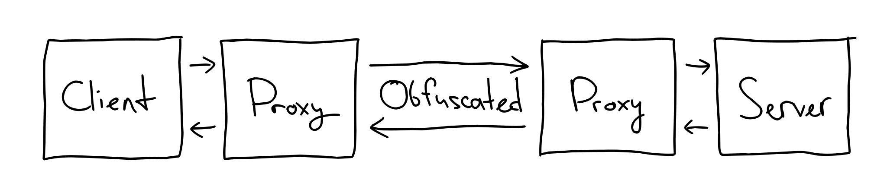

# 🖕🕵 DPIMyAss

DPIMyAss is a simple UDP proxy designed for bypassing DPI with close-to-zero overhead.



## Why? 🤔

I made this proxy to restore the wireguard functionality in places where it was blocked. DPIMyAss is way simpler than the other solutions like, say, shadowsocks, and it does not require messing with the ip interfaces to get it running. All you have to do to set it up with wireguard is run this proxy on both your server and client, and change the endpoint to local proxy address in your wireguard config.

DPIMyAss also does not create any additional overhead on the network. The forwarded packets stay the exact same size they were, and no new packets are created.

## Features 🚀

- **UDP Obfuscation:** DPIMyAss mangles packets, making the underlying protocol unrecognizable to the DPI.
- **Simplicity:** DPIMyAss is extremely simple and small. It's not trying to be what it isn't - there are no custom protocols or complex encryption here.
- **Speed:** DPIMyAss uses simple XOR encryption, which results in almost zero processing overhead.

## Getting Started 🛠️

These instructions will help you set up and run DPIMyAss on your local machine and server.

### Usage 🚦

1. Clone this repo and `cd` into it
2. Build the project:
```bash
cargo build --release
```
3. Run DPIMyAss:
```bash
./target/build/dpimyass [config.toml]
```

### Configuration ⚙️

DPIMyAss uses a TOML configuration file to specify its settings. Below is an example configuration:

```toml
[proxy]
address = "127.0.0.1:1337"
buffer = 16384
timeout = 60

[downstream]
address = "endpoint.example.com:8888"
buffer = 16384
timeout = 60

[obfuscation]
key = [239, 42, 13, 69]
```
